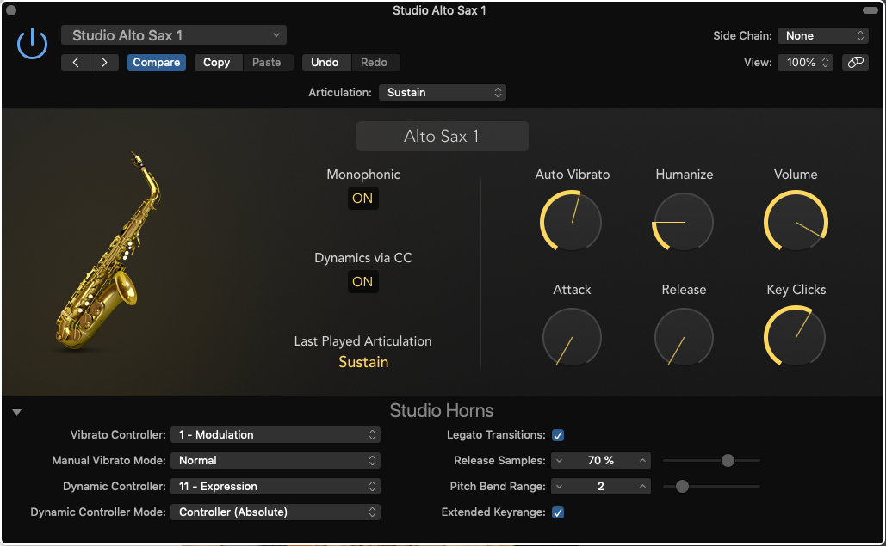
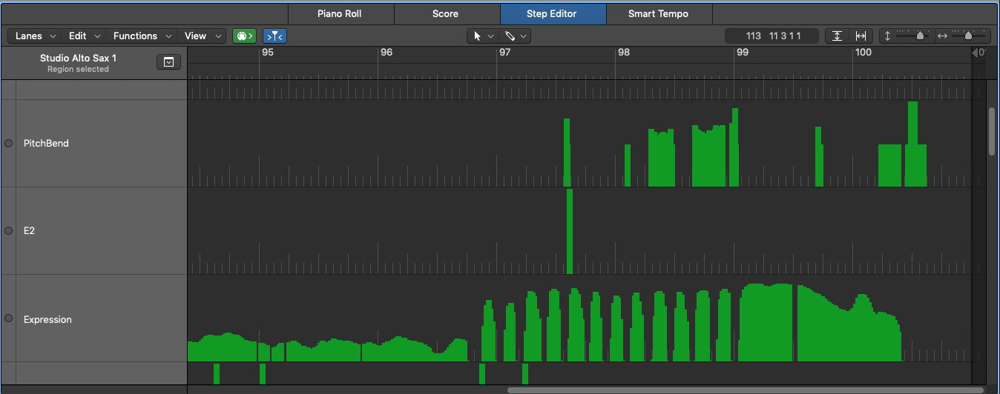
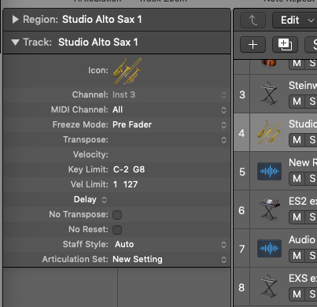
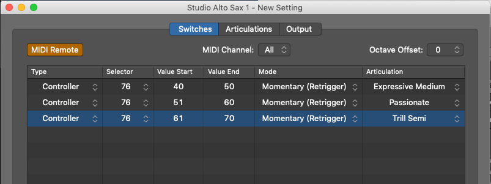

# What is this?

Considering buying or just bought a wind controller (AKA wind synth or electronic wind instrument)? Here's how to get it working well with popular software synthesizers and MIDI-enabled apps – in less than 10 minutes per app. Get to a great starting point quickly.


# Additions and corrections

… are encouraged! Have a software product working well with a wind controller? Email or submit a 5-minute setup, ideally with a screenshot or two.


# Which MIDI messages does my wind controller transmit?

Here's how physical interactions map to MIDI messages with each device's default settings:

* [Akai EWI5000](https://www.akaipro.com/amfile/file/download/file/656/product/43/): Breath (**varies**), Pitch-bend plate (varies), and 2 more
* [Aodyo Sylphyo](https://www.aodyo.com/user-manual-page-en-21.html#section-getting-started.default-mappings): Breath (as **CC#11**), key-bend (as Pitch Bend or CC#78), and 6 more
* [Roland Aerophone AE-10](https://static.roland.com/assets/media/pdf/AE-10_eng03_W.pdf): Breath (as **CC#2**), Bite (as Pitch Bend)
* [Yamaha WX5](https://usa.yamaha.com/files/download/other_assets/4/334594/WX5E.PDF): Breath (as **CC#2**), Pitch bend wheel (as Pitch Bend), and 3-4 more

These defaults can usually be changed in the instrument's firmware.

The configurations in this document were tested with Aodyo Sylphyo.

Related: [CC#2 (often called Breath Control) and CC#11 (often called Expression) are "functionally the same."](https://www.midi.org/forum/855-cc2-vs-cc11) Different controllers and synths chose different default Control Change (CC) message numbers for breath. As long as the instrument and the synth match, the result is identical. If a synth cannot be reconfigured (such as with some hardware synths), use the wind controller firmware to change the output CC#.

**Aftertouch**: In addition, EWI, Sylphyo, and AE-10 can output MIDI aftertouch messages instead of, or in addition to, CC2 or CC11. A few synths which cannot be configured to modulate based on CC2 or CC11 can be configured to modulate based on aftertouch. Here's [an example](https://jimhanks.wordpress.com/2016/11/20/programming-ipad-synths-for-breath-control-part-1/) where breath generates MIDI aftertouch to control iSem.

# Concepts

Other than pitch (chosen by fingering), these are most relevant:

* Breath. Should the sound be sudden and loud or slow and quiet? These are [loudness and attack](http://filmsound.org/articles/ninecomponents/9components.htm). In a synth, breath is often used to control two or more of: volume (loudness), attack, which sample to use (for sampled instruments; AKA "Sample select"), and the cutoff frequency of a filter (AKA "Filter cutoff").
* Pitch bend
* [Vibrato](https://en.wikipedia.org/wiki/Vibrato) intensity and/or rate

# Logic Pro X

## Studio Horns and Studio Strings

[Studio Horns and Studio Strings](https://support.apple.com/en-us/HT208461) work great with very few changes. Change these defaults: enable "Dynamics via CC"; set "Dynamic Controller" to CC#11 or CC#2; set "Dynamic Controller Mode" to "Controller (Absolute)"; enable "Extended Keyrange." Example:



(Don't see a disclosure triangle in the lower left corner? Enable "[Show Advanced Options](https://www.kvraudio.com/forum/viewtopic.php?p=6998183&sid=55bfda87d982dd07bf47fdaf29930acf#p6998183)")

**This may be all you need.** Everything works, including manual vibrato and pitch bend. Enjoy!

**Lots of pitch bends?** Strongly consider disabling "Monophonic" to make it easier to remain between named notes. "Monophonic" is to pitch as quantizing is to tempo.

Note: Studio Horns and Studio Strings are distinct from EXS24. EXS also provides some similarly-named presets (such as cellos), but they are generally less realistic. Ensure that the track's instrument strip has "Horns" or "Strings" rather than "EXS24." If you're trying to sound like a known instrument, use these Studio Instruments; they're more realistic. If you're trying to create your own unique sound, use EXS; it's more flexible.

### Explore

**Tinker**: Here's what the [basic settings](https://support.apple.com/kb/PH27391?locale=en_US) and the [extended parameters](https://help.apple.com/logicpro/mac/10.4/#/lgcp19d099e1) do. The knobs do still affect the sound, even with "Dynamics via CC" enabled. Auto Vibrato, Humanize, and Key Clicks are most relevant. Because breath intensity controls Attack, Release, and Volume, overriding them with unusual values rarely makes sense.

**Articulate**: Articulations make these instruments shine. A cello crescendo or spiccato sounds completely different than standard "Sustain" play. See [Logic tips](#logic-tips) "Change articulation in realtime."

Related: a player's [experiences](https://www.logicprohelp.com/forum/viewtopic.php?t=136387); a sax player's [favorite setup](https://www.kvraudio.com/forum/viewtopic.php?p=6998183&sid=55bfda87d982dd07bf47fdaf29930acf#p6998183) (though I prefer the default Alto Sax 1 with only the minimal changes above); see [Logic Tips](#logic-tips)


## EXS24

**This section is in progress**

Use breath intensity to control relative volume (or even volume), sample selection, and filter cutoff. With just those 3 mappings, EXS can be quite expressive.

https://ewilogic.com/?p=482
https://www.youtube.com/watch?v=_d6y_I2N3kw

[What do the modulation targets and "via" mean?](https://help.apple.com/logicpro/mac/10.4/#/lgsifc864734)

Another set: https://www.logicprohelp.com/forum/viewtopic.php?t=14386&start=20#p89072. This uses Pressure via Velocity (inverted) for Sample Start, Pressure for Relative Volume, and Env1 via Velocity for Filter Cutoff,

Note: For horns and strings, Logic's separate Studio Horns and Studio Strings sound much more realistic than EXS horns and string instruments.

Go deeper: https://logic-users-group.com/threads/akai-ewi-4000s-wind-controller-with-logic-9-mainstage.4242/


## ES2

Pending. Contributions welcome!


## Sculpture (physical modeling)

Pending. Contributions welcome!

Notes:

* Mapping breath: click "Ctrl A Ctrl B" in the lower left corner, then change "MIDI Controller Assign" for "Ctrl B" to either "2 Breath" or "11 Exp" (depending on your controller). To make Ctrl B do something, in the "Contrller B" section to the left of the Morph pane, click the number "1" to activate the first output from Controller B, then click the Target dropdown and choose one. Filter Cutoff and Obj1 Strength are reasonable starting points.
* "Keyboard Mode" (upper right corner) has a significant effect on sound. For a melody, "Mono" or "Legato" are probably better starting points. For sound design ongoing drone sounds, "Poly" may be a better starting point. "Mono" is easiest for testing. "[Excite type](https://support.apple.com/kb/PH27003?locale=en_US&viewlocale=en_US)" also has a major effect (try "Bow").
* Difficulty: 7/10. Try this after using any of the other Logic instruments, which are significantly simpler.


## Logic tips

These tips work with all or nearly all situations.

**See or modify the dynamics that Logic recorded:** Record something, select the recorded MIDI region, and [navigate to the Step Editor](https://support.apple.com/kb/PH13120?locale=en_US&viewlocale=en_US).



**Change articulation in realtime**: Make the most of your controller. Any MIDI CC (or range of values) can change the articulation. For example, physically elevating the Sylphyo changes CC#75. CC#75 could change the articulation to trill. Different articulations can also be triggered by ranges of breath intensity values, like trilling at over 95% intensity.

To define articulation triggers, in the Track options, look for "Articulation Set" and create a new set. Edit the set and map certain CC#s or value ranges to articulations, as shown below. When choosing a trigger type, "Momentary (Retrigger)" is generally what people expect ([more](https://www.vsl.co.at/community/posts/m135734-Key-Switching-Articulations-in-Logic--smartest-way#post135734)). When testing settings, open the effect's settings screen; the "Last Played Articulation" will change in realtime when a threshold triggers.





Alternatively, if you have a MIDI keyboard, playing notes in the lowest octave will trigger Logic's default [articulation keyswitches](https://help.apple.com/logicpro/mac/10.4/#/lgcpa041b9bd).


# KORG iMS-20

iMS-20 does not support MIDI learn, but iMS-20 and many other KORG iOS synths support [static MIDI CC to knob mappings](www.korguser.net/ims20/html/help/en/midi.html). For example, to control the low-pass filter cutoff frequency, a wind instrument should send CC#74. To see this in action, configure your wind instrument to send breath intensity as both MIDI velocity and MIDI CC#74. Use MIDI channel 1.


# Sonic Pi (free)

[This video](https://vimeo.com/214130287) demonstrates a WX-11 controlling Sonic Pi. In general, define a `live_loop`. In the loop, read USB MIDI messages using the `sync` command and use the message values to make sounds with the `control` command.

Here's a script which processes note on, breath intensity, and pitch bend from all MIDI devices and channels:

```
use_synth :hoover
use_real_time
defaults = play 0, release: 200, amp: 0, cutoff_slide: 0.02
set :pitch_bend, 0.0

live_loop :notes do
  note, velocity = sync "/midi/*/*/*/note_on"
  if velocity > 0
    control defaults, note: note, amp: velocity / 127.0
    # add more "control", "sample", or "play" calls here
  end
end

live_loop :breath do
  ccnum, breath_intensity = sync "/midi/*/*/*/control_change"
  if ccnum == 11
    pitch_bend = get :pitch_bend
    control defaults, cutoff: breath_intensity, res: pitch_bend
    # add corresponding add'l "control", "sample", or "play" calls here
  end
end

live_loop :pitch_bend do
  bend_value = sync "/midi/*/*/*/pitch_bend"
  set :pitch_bend, (bend_value[0]-8192) / 8192.0  # convert to range -1.0 to 1.0
end
```

Try other [synths](https://github.com/samaaron/sonic-pi/blob/master/etc/doc/cheatsheets/synths.md) and [samples](https://github.com/samaaron/sonic-pi/blob/master/etc/doc/cheatsheets/samples.md).

**Multiple MIDI devices?**: In the `sync` path of `/midi/*/<X>/<Y>/<event>`, `X` is the order in which the device was plugged in and `Y` is the MIDI channel ([more](https://sonic-pi.net/tutorial.html#section-11-1))). To read CC messages from only MIDI channel 1, use `sync "/midi/*/*/1/control_change"`

### Explore

**Advanced controls**: MIDI CC values can be mapped to [different arguments to "control," "sample," or "play."](https://sonic-pi.net/tutorial.html#section-2-4) Note that some Sonic Pi synths and arguments [can't be changed](https://sonic-pi.net/tutorial.html#section-A-10) after a sound is triggered, though most can. In the example above, a [variable](https://sonic-pi.net/tutorial.html#section-5-6) is `set` to make the most recent pitch bend value accessible from the breath intensity loop.

**Pitch bend**: In the example above, the pitch bend value linearly changes the Hoover synth's resonance (`res`). It can map to any parameter, though, and can be adjusted to better suit the parameter's expected range. When using `sample` instead of `control`, it can actually bend the note using `rpitch` or `rate` ([more](https://github.com/samaaron/sonic-pi/blob/master/etc/doc/tutorial/A.17-sample-stretching.md)). Mediocre examples:

```
sample :ambi_choir, rate: 0.25, sustain: velocity/30.0
sample :ambi_choir, rate: 0.25, sustain: breath_intensity, rpitch: (pitch_bend*13).abs
```

Go deeper: [Michael Brecker effect](https://vimeo.com/214204872), [rotating chords](https://vimeo.com/214356075), [bend example](https://gist.github.com/Enkerli/31b065e0a885a7f61a7c339140247df3), [send OSC](https://sonic-pi.net/tutorial.html#section-12-2)


# Synth1 (free)

Pending. Contributions welcome!


# [Zebralette](https://u-he.com/products/zebralette/) (free)

Zebralette is a plug-in that requires a host DAW (AU, VST, or AAX). If using Logic: install Zebralette, restart Logic, and access Zebralette through a channel strip instrument slot. Alongside EXS24, Mellotron, and other software instruments, look for "AU Instruments." In that menu, a new submenu called "u-he" should be listed.

Supports "User-definable modulation sources" to map breath control (CC#2) and/or expression (CC#11) to most effect controls. See [User Guide](https://uhedownloads-heckmannaudiogmb.netdna-ssl.com/manuals/plugins/zebralette/Zebralette-user-guide.pdf) under "List of Modulation Sources."

A [user](https://www.kvraudio.com/forum/viewtopic.php?p=4908062#p4908062) recommends: "Besides modulating volume, Breath Control (CC #2) in most of the patches is used to modulate oscillator spectral effects and/or waveform selection"

Go deeper: [Patches](https://u-he.com/PatchLib/zebra.html#zlette)


# Zeeon (iOS)

Here's a [demo video](https://www.youtube.com/watch?v=9x0XyIVIDQM) showing how to use [Zeeon](http://www.beepstreet.com/ios/zeeon), an analog modeling synth. Basically, use Zeeon's MIDI Learn to bind CC#2 or CC#11 to Filter Cutoff. As the video shows, the Filter Cutoff knob will turn in realtime as your breath intensity changes.


# VCV Rack (free)

Pending. Contributions welcome!


# Additional reading

* ["How do I synthesize something that sounds like a…"](https://www.soundonsound.com/techniques/synthesizing-wind-instruments) (entire series)
